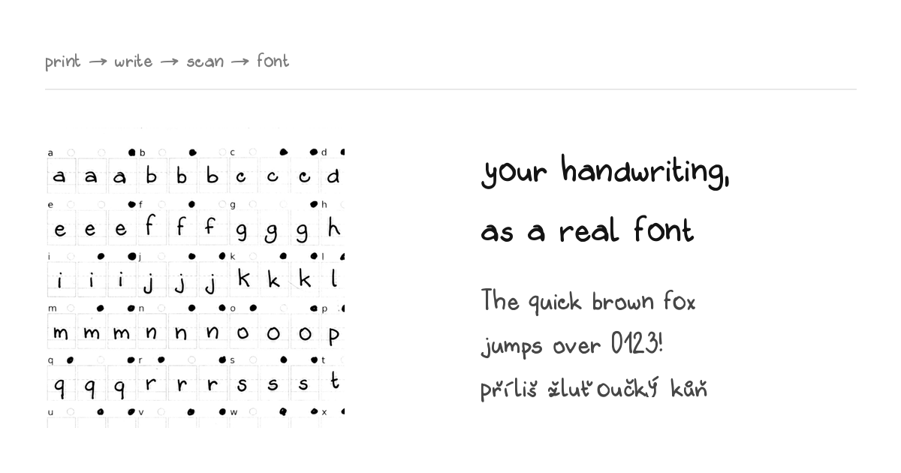

# Handwriting → Font

Turn your handwriting into a real font you can install and type with.
Print a sheet, write on it, scan it, run one command.



- **Variable weight** — Light → Bold from a single pass of one pen
- **No two letters alike** — write each character up to 3× and they rotate as you type
- **29 languages** — Latin, Greek and Cyrillic diacritics, printed as separate sheets
- **Real output** — `.ttf` for macOS/Windows, `.woff2` for the web

---

## Quickstart

```bash
pip install -r requirements.txt        # plus: apt install potrace

# 1. make your sheets (pick the modules you want)
python3 make_template.py --modules english,czech --paper a4 --size book

# 2. print at 100%, write, scan flat at 600 DPI

# 3. build the font
python3 scripts/finalize_font.py --family "My Hand" \
    english=scans/english.jpg czech=scans/czech.jpg
```

Fonts land in `fonts/font-NN_DD-MM_HH-MM/` — variable, static Regular + Bold,
and WOFF2. Install the TTFs, or drop the WOFF2 on a website.

No printer? Fake a filled-in scan and try the pipeline first:

```bash
python3 simulate_scan.py --layout templates/layout-english-a4-book.json --outdir /tmp/sim
python3 scripts/finalize_font.py --family Test english=/tmp/sim/scan-page1.png
```

## How you fill the sheet

Every character gets **three boxes** and a circle above each one. Write it
three times, then **fill in the circle** over the versions you like.

| you do | you get |
|---|---|
| fill 1 circle | that version becomes the letter |
| fill 2–3 | the extras become rotating alternates, so repeats never look cloned |
| fill none | every non-empty box is used |
| leave a box empty | that version is skipped — a botched box costs nothing |

Letters sit on the **solid** line, lowercase bodies reach the **dashed** one.
The sheet's first two pages are a how-to guide; keep them next to you.

## Modules

Print only what you need — every module is a self-contained sheet.

| | |
|---|---|
| **base** | `english` — a–z, A–Z, 0–9 and every key on a US/Mac keyboard |
| **Latin** | `czech` `slovak` `polish` `german` `french` `spanish` `portuguese` `italian` `hungarian` `romanian` `turkish` `dutch` `croatian` `slovenian` `lithuanian` `latvian` `estonian` `danish-norwegian` `swedish` `finnish` `icelandic` `welsh` `esperanto` |
| **Greek / Cyrillic** | `greek` `ukrainian` `russian` `bulgarian` `serbian` |
| **extras** | `symbols` (typographic) · `math` · `fun` (arrows, hearts, stars) · `ligatures` (joined pairs) · `small-caps` |

Each language module stands alone, so *english + slovak but not polish* just
works. Add a module later, rescan, rebuild — the font grows.

Two sizes: `--size book` (landscape, two A5 halves like an open notebook —
natural writing size, recommended) or `--size normal` (big boxes, portrait).

## What happens under the hood

1. **`make_template.py`** draws the sheets. Guides print light gray so they
   vanish at threshold; only the corner marks are black.
2. **`segment.py`** finds those corner marks, fits an affine transform
   (rotation, scale and offset absorbed — no careful scanning needed), crops
   every box, and reads which circles you filled.
3. **`build_font.py`** traces the ink with potrace, **snaps each letter onto
   the baseline** so the line doesn't bounce, evens out letter sizes (keeping
   the pen weight — a shrunk letter gets its stroke thickened back), and
   compiles a TTF with `calt` alternates, `liga` ligatures, `smcp` small caps
   and **shape-based kerning** so `To` and `Va` tuck in. Curly quotes and
   dashes are mapped to the plain ones you wrote, so text never falls back to
   another font mid-word.
4. **`make_variable.py`** derives Light and Bold by pushing every outline
   point along its normal, then interpolates a variable font.
5. **`scripts/package_font.py`** exports the installable set.

## Tuning

| symptom | fix |
|---|---|
| letters are different sizes | raise `--normalize` (0.8 evens them out) |
| one letter is too big / sits wrong | `--adjust-file` — see below |
| your worst version became the letter | `--primary o=2` picks another box |
| arrows and dashes ride high | `--center-symbols` |
| two letters merge | lower `--max-tuck` |
| gray guides show up in glyphs | lower `--threshold` |
| thin strokes break apart | raise `--threshold`, or rescan darker |
| words too loose | lower `--target-gap` |
| font sets too large | lower `--glyph-scale` |
| bold looks clogged | lower `--bold-offset` |

Any single character can be nudged without rescanning anything — scale it,
move it up or down, or give it more air on either side:

```json
{ "d": {"scale": 0.93}, "y": {"dy": -30}, "i": {"lsb": 14, "rsb": 14} }
```

```bash
python3 build_font.py --cells work/cells --out my.ttf --adjust-file tweaks.json
```

## Good to know

- **Print at 100%** — never "fit to page". Sheets are versioned; an old
  sheet won't line up with a newly generated layout.
- Use **one pen** for everything (≥0.5 mm, black). Light and Bold are
  computed, so you never write thick and thin versions.
- Generated PDFs aren't committed — run `make_template.py` to get them.
- A font can't reproduce ink exactly; it reuses shapes. Alternates and
  ligatures are what buy back the hand-drawn feel — use them.

## Limits & ideas

No slant axis yet (would need a second writing pass). Vietnamese is missing —
its 130+ precomposed characters want a differently-shaped sheet. Contributions
welcome.

MIT licensed. Fonts you build from your own handwriting are entirely yours.
